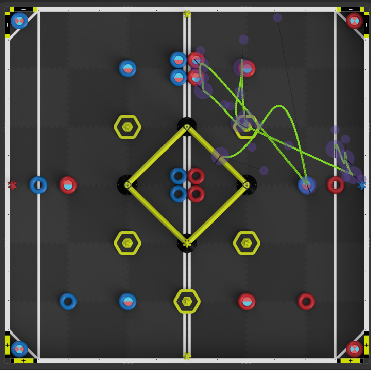
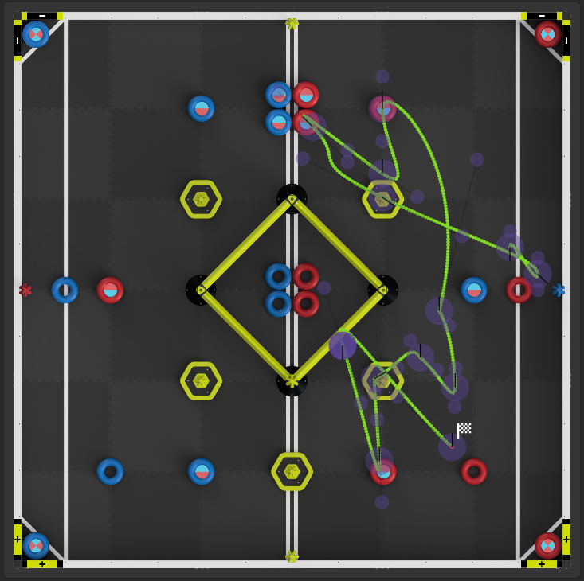
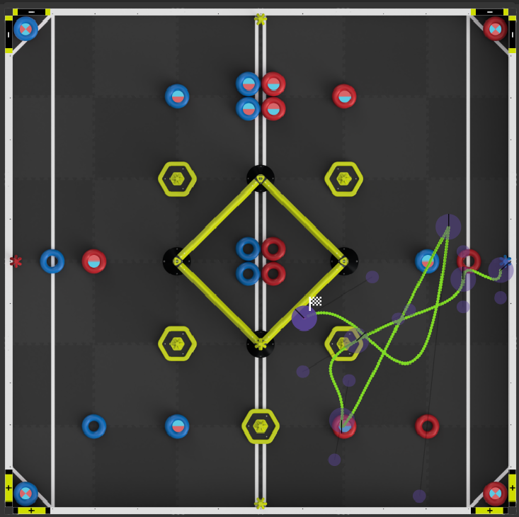

# Team 88168A Robotics Project

## Introduction

Welcome to **Team 88168A's Robotics Project** repository! This repository contains the source code for our team's robot, which is used in various robotics competitions. We leverage the **VEX Robotics platform** for both the hardware and software, with our code built to control the robot's movements and actions during matches.

Our team is dedicated to developing **efficient**, **innovative**, and **competitive solutions** for both autonomous and driver-controlled operations. We integrate **advanced control systems**, **sensors**, and **feedback loops** to ensure smooth and effective functionality in competitive environments.

## Project Structure

This project is based on the **VEX Robotics V5 system**, with the code written in **C++** using the VEX V5 C++ API. The repository is organized into several key components to manage the robot's functions and capabilities:

- **Autonomous Code**: This code runs when the robot is operating autonomously, i.e., without any input from the driver. It includes functions to control the robot’s movements, sensor inputs, and actions, based on pre-programmed strategies.
- **Driver Control Code**: This section handles inputs from the controller, allowing real-time control over the robot’s motors, sensors, and actuators during the driver-controlled period of a match.
- **Sensor Integration**: We utilize various sensors, such as optical sensors and encoders, to enhance the robot's autonomous navigation and provide feedback during the match for better decision-making.
- **Subsystems**: The robot includes multiple subsystems, including the drivetrain, intake system, and arm mechanism. These subsystems are controlled independently to optimize performance during a match.

## Key Features

- **Autonomous Movement**: The robot can move and interact with the environment based on pre-programmed strategies, such as navigating the field, manipulating objects, and scoring goals autonomously.
- **Tank Drive Control**: The robot uses tank drive, where the left and right motors are controlled by joystick inputs. The left joystick controls the left side of the robot, and the right joystick controls the right side.
- **Arm Control**: A custom arm control logic ensures precise movement and positioning of the robot’s arm, based on sensor feedback, allowing the robot to interact with game elements effectively.
- **Sensor Feedback**: The robot uses sensors to detect objects, adjust its path, and interact with the environment. For example, sensors are used to detect nearby obstacles or the position of game pieces.

## Key Components and Functions

Here are some of the important functions implemented in our code:

- **`control_tank()`**: This function controls the left and right drive motors based on joystick inputs from the controller, with deadband adjustments for smooth control.
- **`noteTask()`**: Handles autonomous behaviors, such as detecting and interacting with objects based on the selected team color. It controls the intake system and other mechanisms for pre-programmed strategies.
- **`hangTask()`**: Manages the robot’s hanging mechanism during autonomous or driver control, responding to button inputs to adjust the position of the robot’s arm.
- **`position_track_task()`**: Ensures the robot maintains its heading and position throughout the match using real-time tracking.
- **`momogo_task()`**: Utilizes optical sensors to detect the distance to a mobile goal, changing the LED indicator lights accordingly: flashing lights indicate proximity, a green light shows that pneumatic pressure is off, and a red light means pneumatic pressure is on.
- **`intake_task()`**: This function controls the robot's intake system based on the controller's button inputs. It uses R1 to activate the intake motor for forward rotation (to pick up game pieces) and R2 to activate the motor for reverse rotation (to eject or reverse the intake direction). The function adjusts the motor speed accordingly and ensures smooth operation of the intake system, allowing the driver to control the intake's direction in real-time during the match.

## Setup

To get started with this project, follow these steps:

1. **Clone the repository** to your local machine.
2. **Open the project** in **VEXcode V5** or your preferred C++ IDE for VEX Robotics.
3. **Connect the VEX V5 robot** to your computer using a USB cable.
4. **Build and download the code** to the robot's brain.

## Usage

### Autonomous Path

The robot automatically performs pre-defined tasks at the start of the match, based on the selected team color and programmed strategy. Some example strategies include:
||Alliance stack 4or5 ring|** Solo AWP ** :trophy:|Alliance stack 2or3 ring|
|--|--|--|--|
||||
|Average Rings|4~5|3|2~3|
|Average Mobile goals|1|2|1|

### Driver Control

In the driver-controlled period of the match, the robot is controlled using the **VEX controller**. The joystick inputs control the movement of the robot:

- The **left joystick** controls the left side of the robot.
- The **right joystick** controls the right side.
  
Additionally, the intake and arm systems can be controlled with specific buttons on the controller for tasks like lifting, lowering, or positioning objects.

### Arm and Intake Control

The intake and arm systems are controlled using buttons on the VEX controller. These systems are designed to efficiently handle and manipulate objects during the match, ensuring precise movement and positioning based on sensor feedback.
## Onboard Electronics

### Motors

|Subsystem|Type|Name|Port:ID|Note|
|--|--|--|--|--|
|Chassis|11W motor|Drive|1,3,4,6,9,10|L1,L2,L3,R1,R2,R3|
|Intake|5.5W motor|Drive|11,14|down,mid|
|Arm|11W motor|Drive|19|hang1|

### Sensors 

|Subsystem|Port:ID|Note|
|--|--|--|
|Inertial|5|gyro|
|Optical|7|see ring|
|Optical_go|12|see moblie go|
|Vision|13,15|light support|
|light|C,D|redlight,whitelight|
|Pneumatic cylinder|A,B,G|pushCylinder,intakeCylander,hookCylinder|

## Acknowledgements

- **VEX Robotics** for their hardware and software support.
- **HappyrobotTaipei** for their contributions to the development.
- **Team 88168A** for their hard work, dedication, and passion for robotics.
- Special thanks to **R.T.1.3**, **Lego Lau mo**, and **Teng Lau** for their support.

---

Feel free to explore, modify, and contribute to this repository as we continue to enhance our robot’s capabilities for future competitions. Thank you for your interest in Team 88168A’s robotics project!

---
